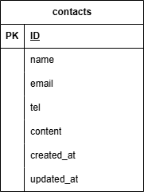

# お問い合わせフォーム

お問い合わせ用のフォームです。

フォームに入力しデータを送信すると、入力確認用ページが表示され、入力内容を確認し再度送信すると、お問い合わせ完了ページが表示されます。

## 環境構築

####リポジトリをクローン

```
git clone git@github.com:ikemi-yuki/contact-form2.git
```

#### Laravelのビルド

```
docker-compose up -d --build
```

#### Laravelパッケージのダウンロード

```
docker-compose exec php bash
```

```
composer install
```

#### .envファイルの作成

```
cp .env.example .env
```

#### .envファイルの修正

```
DB_HOST=mysql

DB_DATABASE=laravel_db

DB_USERNAME=laravel_user

DB_PASSWORD=laravel_pass
```

#### キー生成

```
php artisan key:generate
```

#### マイグレーションを実行

```
php artisan migrate
```

## 使用技術（実行環境）

フレームワーク：Laravel

言語：HTML CSS PHP

Webサーバー：Nginx

データベース：MySQL

## ER図



## URL

アプリケーション：http://localhost/

phpMyAdmin：http://localhost:8080/
